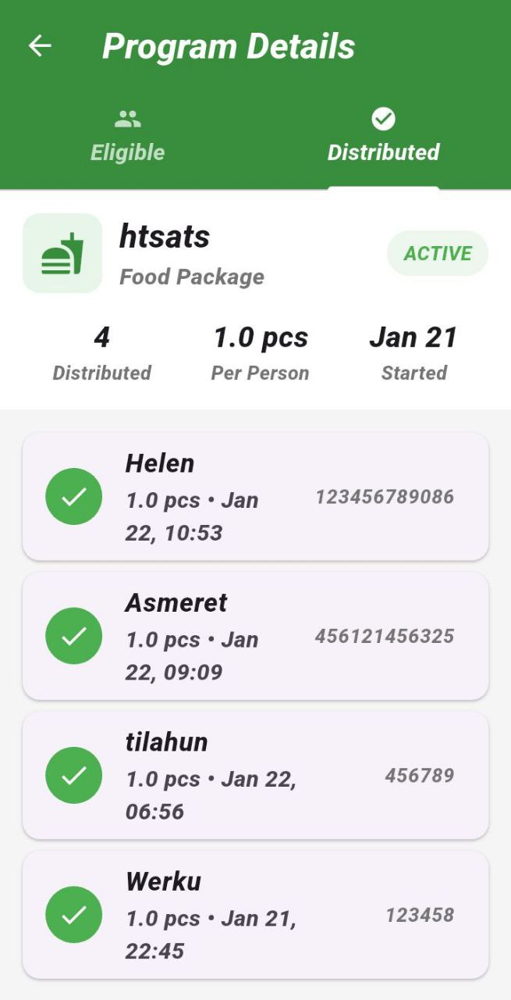

---

# Smart Aid Distribution

Smart Aid Distribution is a Flutter web and mobile app we built to help humanitarian organizations manage aid distribution more efficiently. The system helps staff register beneficiaries, prioritize the most vulnerable people, and track distributions.

The mobile app works **offline**, which is important for field workers in areas with weak connectivity. When the device reconnects to the internet, the data automatically syncs. The web version is mainly for administrators who manage programs and reports from a desktop.

---

## Features

**Beneficiary Registration**

Field workers can register beneficiaries with:

* Personal information
* Photo capture
* GPS location
* Vulnerability indicators

**Priority Scoring**

The system calculates a vulnerability score to help organizations decide **who should receive aid first**.

**Aid Programs**

Admins can create and manage distribution programs with budgets and beneficiary lists.

**QR Code Identification**

Each beneficiary receives a QR code that can be scanned during distribution for fast identification.

**Reporting and Export**

Data can be exported to **Excel** for reporting or auditing.

**User Roles**

Different permissions exist for:

* Admin users
* Field staff

---

## Tech Stack

* **Flutter** (single codebase for web and mobile)
* **Riverpod** for state management
* **Firebase Authentication**
* **Firestore database**
* **Cloudinary** for image storage
* **QR code generation and scanning**

---

## App Screenshots

| Login                                      | Admin Dashboard                            | Beneficiary Form                         |
| ------------------------------------------ | ------------------------------------------ | ---------------------------------------- |
|  |  |  |

| Beneficiary Form                         | Beneficiary Form                         | Beneficiary Form                         |
| ---------------------------------------- | ---------------------------------------- | ---------------------------------------- |
|  |  |  |

| User Management                           | QR Code Generation                          | QR Scan                                 |
| ----------------------------------------- | ------------------------------------------- | --------------------------------------- |
|  |  |  |

| Export                                      | Distributed List                                 | Program Details                              |
| ------------------------------------------- | ------------------------------------------------ | -------------------------------------------- |
|  |  |  |

| Distribution Programs                         |
| --------------------------------------------- |
|  |

---

## Getting Started

### Prerequisites

* Flutter SDK `^3.9.2`
* Firebase project
* Cloudinary account

---

### Setup

Clone the repository and install dependencies:

```bash
git clone <your-repo>
cd smartaid
flutter pub get
```

Create environment variables:

```bash
cp .env.example .env
```

Add your Cloudinary and API credentials inside `.env`.

---

### Firebase Setup

1. Create a project in Firebase Console
2. Enable **Email/Password Authentication**
3. Create a **Firestore database**
4. Download configuration files
5. Run:

```bash
flutterfire configure
```

---

### Run the App

For mobile:

```bash
flutter run
```

For web:

```bash
flutter run -d chrome
```

---

## Project Structure

```
lib/
├── screens      # UI screens
├── widgets      # reusable UI components
├── models       # data models
├── providers    # Riverpod state management
├── services     # Firebase and API logic
├── utils        # helper functions
└── config       # environment configs
```

---

## Testing

Run tests with:

```
flutter test
```

---

## Platforms

* Android – main target for field workers
* iOS – supported
* Web – used by admins
* Windows – partially supported

---

## License

Private project.

---
