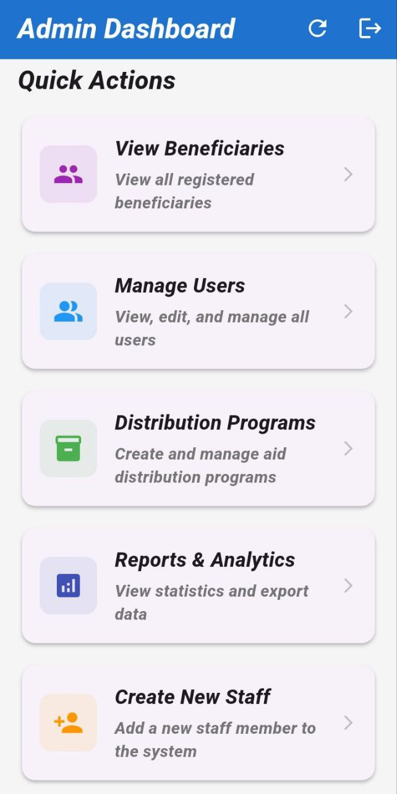
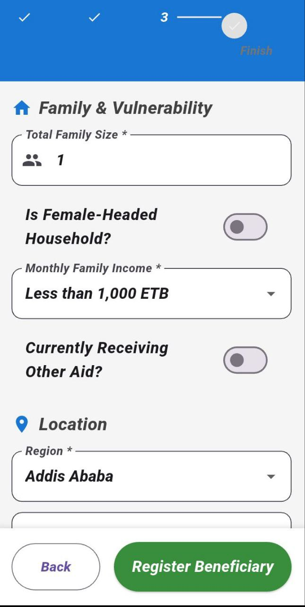
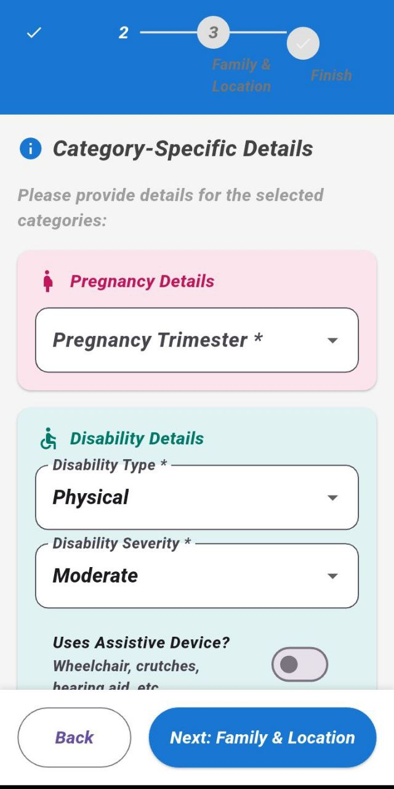
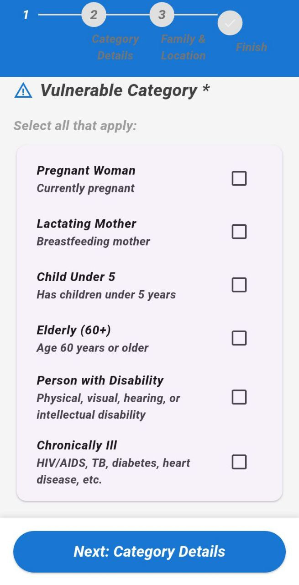
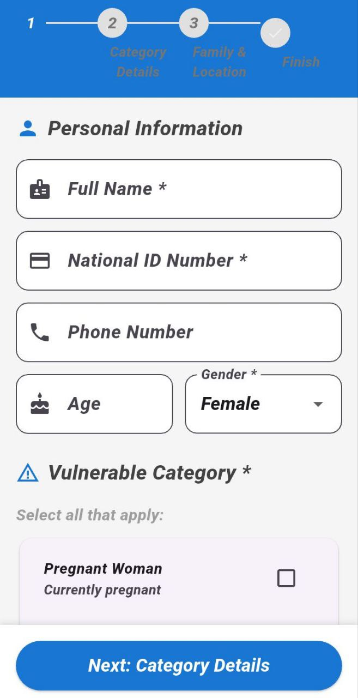
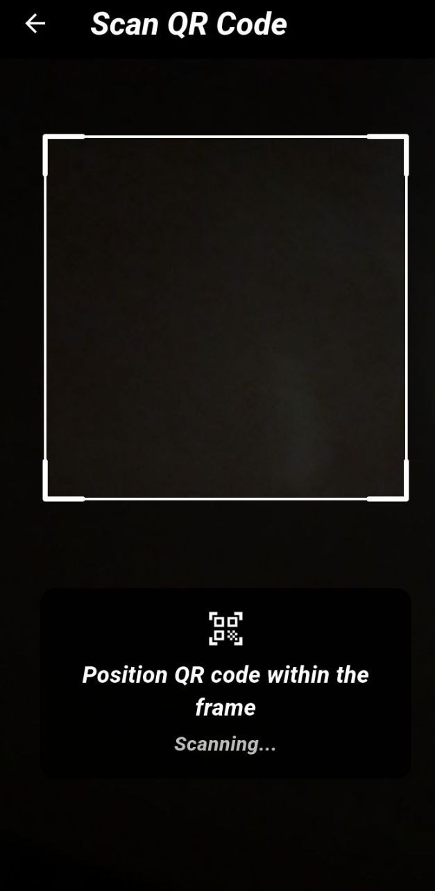
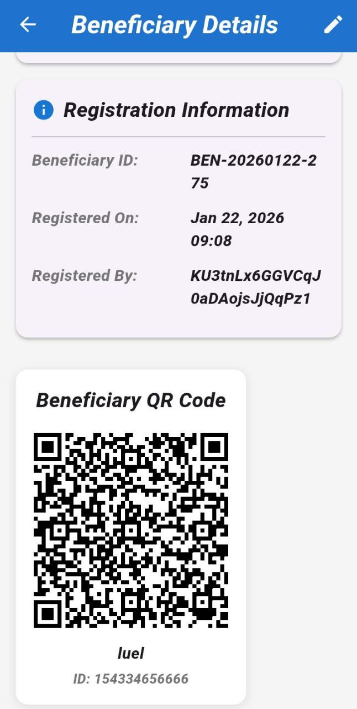
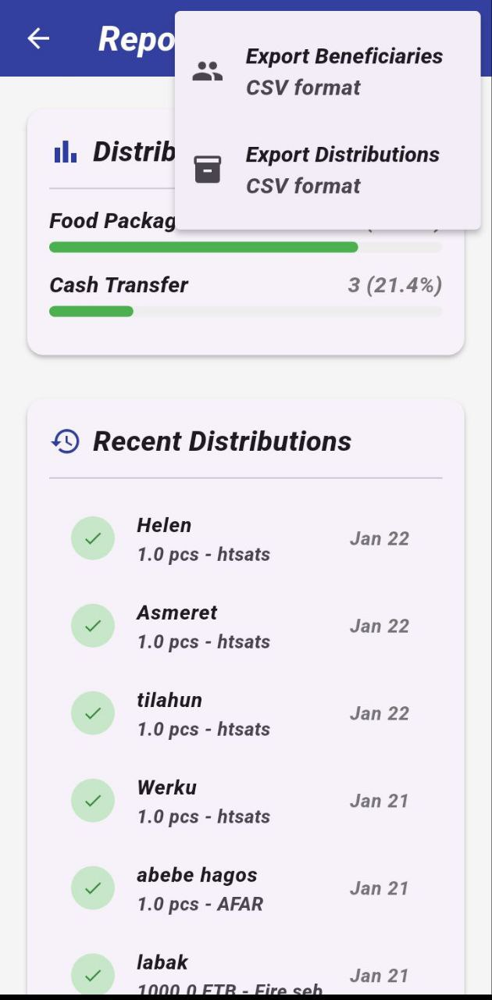
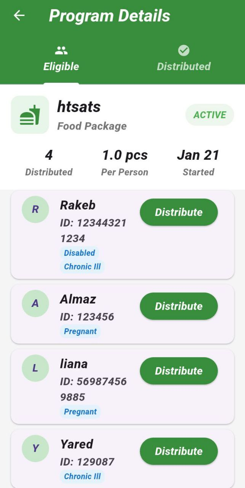
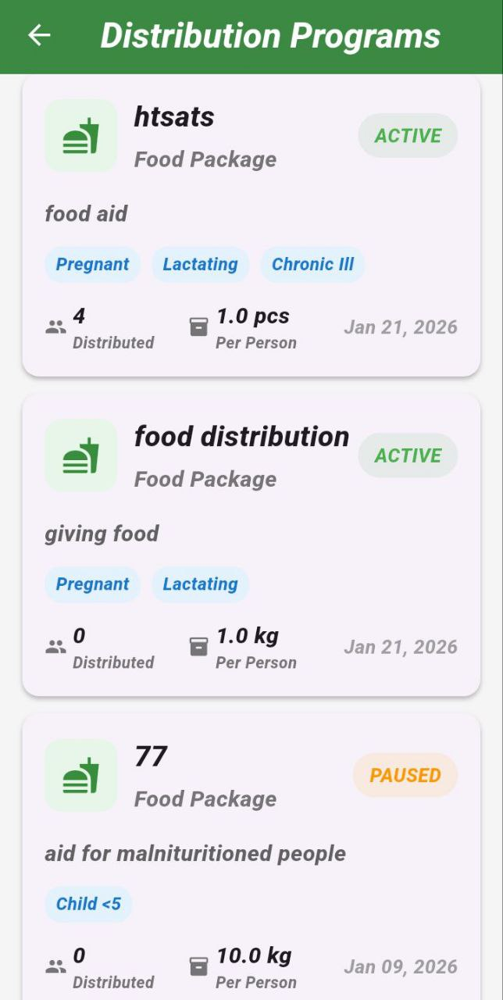

Smart Aid Distribution
A Flutter web and mobile app we built for managing humanitarian aid distribution with intelligent beneficiary prioritization.

Overview
We created this app to help aid organizations register beneficiaries, figure out who needs help the most, and track distributions. It works offline on mobile (super important for field work) and syncs when you're back online. The web version is perfect for office work - admins can manage everything from a desktop browser.

What It Does
Beneficiary Management - Register people with photos, GPS location, and vulnerability info

Priority Scoring - Automatically calculates who needs aid most urgently

Distribution Programs - Create and manage aid programs with budgets

QR Code System - Each beneficiary gets a scannable code for quick lookup

Reports & Export - Export data to Excel for reporting

User Roles - Admins and staff have different permissions

Built With
Flutter + Riverpod (state management) - runs on web and mobile from same codebase

Firebase (Auth + Firestore)

Cloudinary (image storage)

QR code generation + scanning

App Screenshots
Here's a complete tour of the app:

Login Page	Admin Dashboard	Beneficiary Form (Page 1)
		
Beneficiary Form (Page 2)	Beneficiary Form (Page 3)	Beneficiary Form (Page 4)
		
User Management	QR Code Generation	QR Code Scan
		
Export Screen	Distributed List	Program Details
		
Distribution Programs		
		

Getting Started
Prerequisites
Flutter SDK (^3.9.2)

Firebase project

Cloudinary account (free tier works)

Quick Setup
Clone and install

bash
git clone <your-repo>
cd smartaid
flutter pub get
Environment variables

bash
cp .env.example .env
# Add your Cloudinary and API keys
Firebase setup

Create project at Firebase Console

Enable Email/Password auth

Set up Firestore

Download config files

Run flutterfire configure

Run it

bash
# For mobile
flutter run

# For web
flutter run -d chrome
Project Structure
text
lib/
├── screens/     # All UI screens (login, dashboard, forms, etc)
├── widgets/     # Reusable buttons, cards, etc
├── models/      # Data classes
├── providers/   # Riverpod state
├── services/    # Firebase, API calls
├── utils/       # Helper functions
└── config/      # Environment configs
Testing
bash
flutter test
Works On
✅ Android (main target for field workers)

✅ iOS (works great)

✅ Web (perfect for office/admin work)

⚠️ Windows (most features work)

License
Private project.
